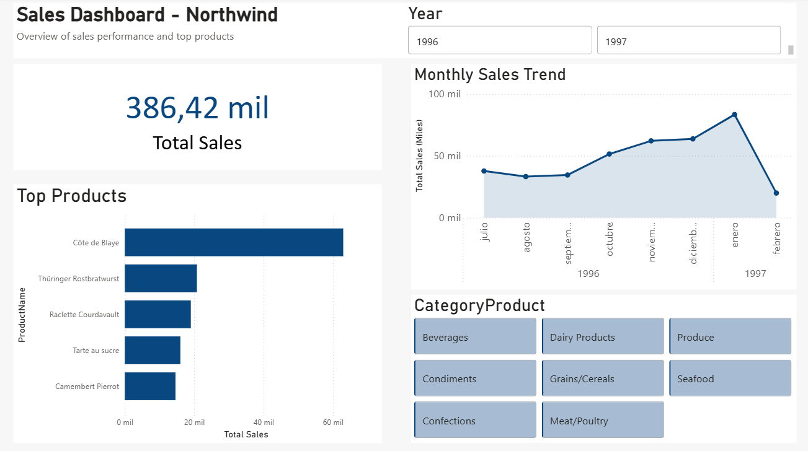

# Northwind Sales Dashboard

## 📊 Project Overview
End-to-end data analysis project using the Northwind dataset.

The project covers:
- SQL analysis
- Data modeling
- Power BI dashboarding

## 🛠️ Tools Used
- SQL (SQLite)
- Power BI
- GitHub

## 📈 Key Insights
- Total sales analysis
- Monthly sales trends
- Top 5 products by revenue

## 🧠 Challenges Solved
- Data type inconsistencies (decimal separator issues)
- Data modeling and relationship optimization
- Validation of Power BI results against SQL queries

## 📷 Dashboard Preview

